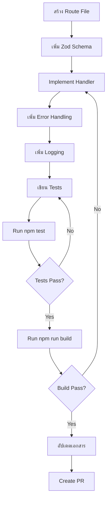

# API Routes Catalog

รายการ API endpoints ทั้งหมดในระบบ Super Platform

---

## Platform API Routes

### Authentication & Session

| Method | Path | Module | Auth Required | Permission/RBAC | Success | Common Errors | Notes |
|--------|------|--------|---------------|-----------------|---------|---------------|-------|
| GET | `/api/auth/context` | Auth | ✅ Yes | Any authenticated user | 200 | UNAUTHORIZED | ดึงข้อมูล user context + permissions |
| GET | `/api/auth/session` | Auth | ✅ Yes | Any authenticated user | 200 | UNAUTHORIZED | ตรวจสอบ session status |

### Platform Management

| Method | Path | Module | Auth Required | Permission/RBAC | Success | Common Errors | Notes |
|--------|------|--------|---------------|-----------------|---------|---------------|-------|
| GET | `/api/platform/me` | Platform | ✅ Yes | Platform Owner | 200 | FORBIDDEN, UNAUTHORIZED | ดึงข้อมูล platform user ตัวเอง |
| GET | `/api/platform/orgs` | Platform | ✅ Yes | Platform Owner | 200 | FORBIDDEN | List organizations |
| GET | `/api/platform/roles` | Platform | ✅ Yes | Platform Owner | 200 | FORBIDDEN | ดึง roles + available permissions |
| PATCH | `/api/platform/roles` | Platform | ✅ Yes | Platform Owner | 200 | FORBIDDEN, VALIDATION_ERROR | อัปเดต role permissions |
| GET | `/api/platform/users` | Platform | ✅ Yes | Platform Owner | 200 | FORBIDDEN | List platform users |
| POST | `/api/platform/users` | Platform | ✅ Yes | Platform Owner + Permission | 201 | FORBIDDEN, VALIDATION_ERROR, CONFLICT | สร้าง platform user ใหม่ |
| GET | `/api/platform/users/[uid]` | Platform | ✅ Yes | Platform Owner | 200 | FORBIDDEN, NOT_FOUND | ดูรายละเอียด user |
| PATCH | `/api/platform/users/[uid]` | Platform | ✅ Yes | Platform Owner + Permission | 200 | FORBIDDEN, VALIDATION_ERROR, BAD_REQUEST | แก้ไข user (role, enabled, etc.) |
| DELETE | `/api/platform/users/[uid]` | Platform | ✅ Yes | Platform Owner + Permission | 200 | FORBIDDEN, BAD_REQUEST | ลบ user (soft delete) |

### Platform Insights & Monitoring

| Method | Path | Module | Auth Required | Permission/RBAC | Success | Common Errors | Notes |
|--------|------|--------|---------------|-----------------|---------|---------------|-------|
| GET | `/api/platform/insights` | Platform | ✅ Yes | Platform Owner | 200 | FORBIDDEN, INTERNAL_ERROR | Aggregated insights ทุก orgs |
| GET | `/api/platform/insights/[orgId]` | Platform | ✅ Yes | Platform Owner | 200 | FORBIDDEN, NOT_FOUND, INTERNAL_ERROR | Insights specific org |
| GET | `/api/platform/audit-logs` | Platform | ✅ Yes | Platform Owner | 200 | FORBIDDEN, INTERNAL_ERROR | ดู audit logs (limit 100) |

---

## Role Management API Routes

| Method | Path | Module | Auth Required | Permission/RBAC | Success | Common Errors | Notes |
|--------|------|--------|---------------|-----------------|---------|---------------|-------|
| GET | `/api/roles` | Roles | ✅ Yes | Platform Owner | 200 | FORBIDDEN, INTERNAL_ERROR | List all roles |
| POST | `/api/roles` | Roles | ✅ Yes | Platform Owner | 201 | FORBIDDEN, VALIDATION_ERROR, INTERNAL_ERROR | สร้าง role ใหม่ |
| GET | `/api/roles/[id]` | Roles | ✅ Yes | Platform Owner | 200 | FORBIDDEN, NOT_FOUND, INTERNAL_ERROR | ดูรายละเอียด role |
| PUT | `/api/roles/[id]` | Roles | ✅ Yes | Platform Owner | 200 | FORBIDDEN, VALIDATION_ERROR, NOT_FOUND, INTERNAL_ERROR | อัปเดต role |
| DELETE | `/api/roles/[id]` | Roles | ✅ Yes | Platform Owner | 200 | FORBIDDEN, BAD_REQUEST, NOT_FOUND, INTERNAL_ERROR | ลบ role (ห้ามลบ system roles) |
| POST | `/api/roles/copy` | Roles | ✅ Yes | Platform Owner | 201 | FORBIDDEN, VALIDATION_ERROR, INTERNAL_ERROR | Copy role ไปเป็น role ใหม่ |

---

## Test Routes (Development Only)

| Method | Path | Module | Auth Required | Permission/RBAC | Success | Common Errors | Notes |
|--------|------|--------|---------------|-----------------|---------|---------------|-------|
| GET | `/api/test/success` | Testing | ❌ No | - | 200 | - | ทดสอบ success response |
| GET | `/api/test/errors` | Testing | ❌ No | - | 500 | INTERNAL_ERROR | ทดสอบ error response |
| POST | `/api/test/validation` | Testing | ❌ No | - | 400 | VALIDATION_ERROR | ทดสอบ validation errors |

---

## Error Codes Reference

| Code | Status | ใช้ใน Routes |
|------|--------|-------------|
| `VALIDATION_ERROR` | 400 | POST/PATCH/PUT ทุก routes ที่รับ body |
| `BAD_REQUEST` | 400 | DELETE roles (system role), DELETE users (self/hierarchy) |
| `UNAUTHORIZED` | 401 | ทุก routes ที่ต้อง auth |
| `FORBIDDEN` | 403 | ทุก platform routes (ต้องเป็น Owner) |
| `NOT_FOUND` | 404 | GET/PUT/DELETE ของ [id] routes |
| `CONFLICT` | 409 | POST users (email ซ้ำ) |
| `INTERNAL_ERROR` | 500 | ทุก routes (unexpected errors) |

---

## Authentication & Authorization Summary

### Authentication Methods
- **Firebase Auth Token**: ส่งผ่าน cookies หรือ Authorization header
- **Middleware**: `requireOwner()`, `requirePlatformAccess()`

### Role Hierarchy
```
Owner > Admin > Editor > Viewer
```

### Permission System
- **Platform Permissions**: `manage_users`, `manage_roles`, `view_audit_logs`, etc.
- **Org Permissions**: ยังไม่ implement (reserved for future)

---

## Response Format

ทุก routes ใช้ standardized response format ตาม [API Contract](./api-contract.md):

### Success
```json
{
  "success": true,
  "data": { ... }
}
```

### Error
```json
{
  "success": false,
  "error": {
    "code": "VALIDATION_ERROR",
    "message": "...",
    "errorId": "err_xxx",
    "timestamp": "..."
  }
}
```

---

## How to Add New Route

เมื่อต้องการเพิ่ม API route ใหม่ ให้ทำตามขั้นตอนนี้:

### 1. ใช้ Standardized Response Builders
```typescript
import { ApiSuccessResponse, ApiErrorResponse } from '@/lib/api';

// ✅ DO: ใช้ builders
return ApiSuccessResponse.ok(data);
return ApiErrorResponse.validationError(errors);

// ❌ DON'T: ใช้ NextResponse.json โดยตรง
return NextResponse.json({ success: true, data });
```

### 2. เพิ่ม Zod Validation Schema
```typescript
import { z } from 'zod';
import { validateRequest } from '@/lib/api';

const createSchema = z.object({
  name: z.string().min(1, 'Name is required'),
  email: z.string().email('Invalid email'),
});

const validation = validateRequest(createSchema, body);
if (!validation.success) {
  return ApiErrorResponse.validationError(validation.errors);
}
```

### 3. ใช้ handleError + logApiError
```typescript
import { handleError } from '@/lib/errors';
import { logApiError } from '@/lib/api/logging';

try {
  // ... business logic
} catch (error) {
  const appError = handleError(error as Error);
  logApiError({
    method: 'POST',
    path: '/api/your-route',
    errorId: appError.errorId,
    message: appError.message,
  });
  return ApiErrorResponse.internalError();
}
```

### 4. เพิ่ม Integration Tests
```typescript
// tests/api/your-route.test.ts
import { describe, it, expect, vi } from 'vitest';
import { GET } from '@/app/api/your-route/route';

describe('GET /api/your-route - Success', () => {
  it('should return 200 with success response', async () => {
    const response = await GET();
    const { status, data } = await parseResponse(response);
    
    expect(status).toBe(200);
    expect(data.success).toBe(true);
  });
});
```

### 5. อัปเดตเอกสาร
- [ ] เพิ่ม route ในไฟล์นี้ (`docs/api/routes.md`)
- [ ] ระบุ auth requirements, permissions, และ error codes
- [ ] เพิ่มตัวอย่างใน API Contract (ถ้าจำเป็น)

---

## Development Workflow



---

## Related Documentation

- [API Contract](./api-contract.md) - Response format specification
- [Error ID Playbook](../observability/errorid-playbook.md) - Debug guide
- [Response Contract](./response-contract.md) - Type definitions
- [Integration Tests](../../tests/api/) - Test examples

---

**Total Routes:** 23 endpoints  
**Last Updated:** 2026-01-20  
**Status:** ✅ All routes migrated to standardized format
